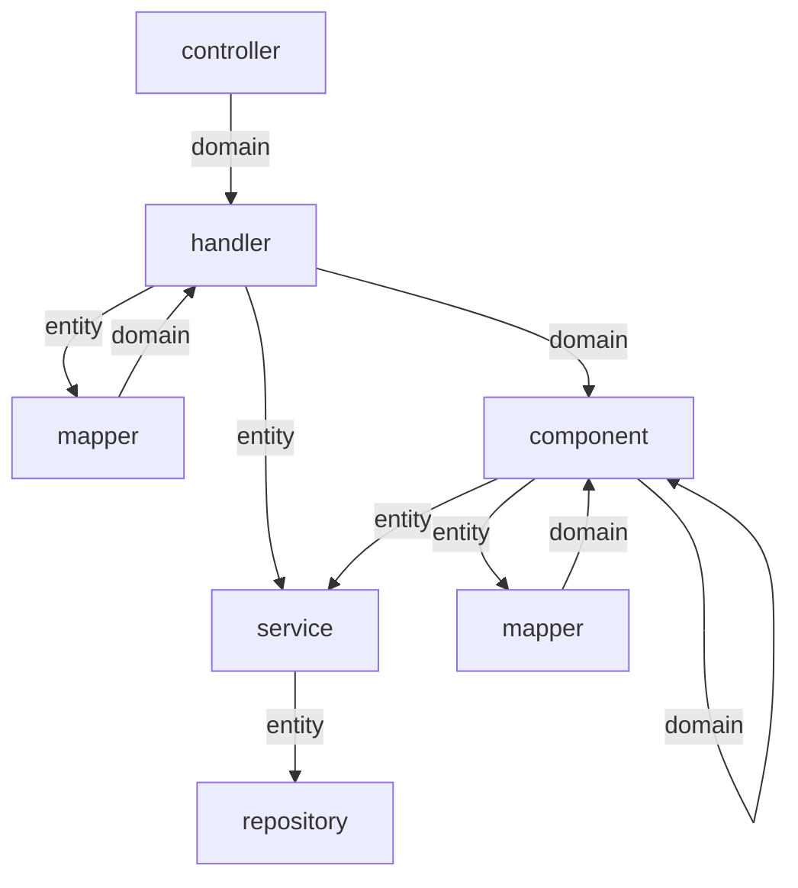

**项目风格和规范**

[TOC]

### 1. 项目规范

#### 1.1 编码规范

严格按照《**阿里巴巴Java开发手册**》进行代码编写。

IDEA安装阿里规约插件 **Alibaba Java Coding Guidelines**


#### 1.2 前后端交互文档

使用 swagger2 的注解自动生成文档

```yaml
<dependency>
    <groupId>io.springfox</groupId>
    <artifactId>springfox-swagger2</artifactId>
</dependency>
```


#### 1.3 响应前端的数据格式

##### 1.3.1 正常数据根式

```json
{
    "success":true,
    "data":{}
}
```

##### 1.3.2 异常数据格式

```json
{
    "success":false,
    "code": 404,
    "msg":"数据不存在"
}
```


#### 1.4 目录结构

**包的功能**

| 文件夹名   | 功能                             |
| ---------- | -------------------------------- |
| controller | 访问路由                         |
| handler    | 业务处理                         |
| service    | 数据接入服务封装，可以做缓存功能 |
| repository | 数据接入                         |
| component  | 共同业务逻辑                     |
| domain     | 前端数据实体                     |
| entity     | 数据库实体                       |
| constants  | 常量，枚举                       |
| mapper     | 数据库实体转换成前端数据实体     |

**包之间调用**




#### 1.5 前端数据校验

##### 1.5.1 基础校验

使用validator做基础数据校验，比如Null，空字符串等


